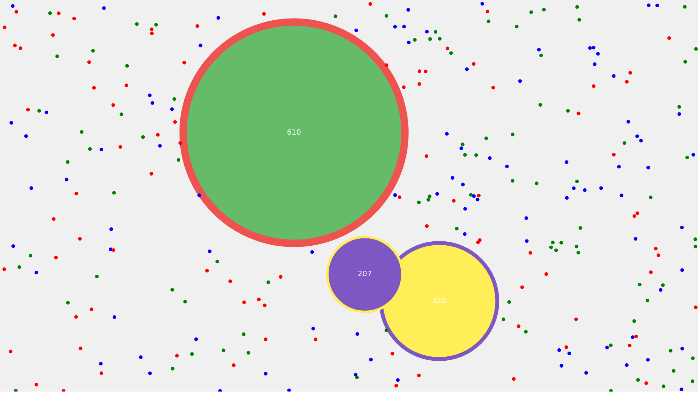

# Flat Candies

[p5]: https://p5js.org/
[game]: https://you-create.github.io/flat-candies
[game-openprocessing]: https://www.openprocessing.org/sketch/854109

**[Play the game][game]** :candy:

[][game]

An action game I've made in [p5.js][p5]! Have at least a friend to play with
you and start playing! Eat candies and opponents! Shrink to run away from or
chase other players!

_[Originally published on OpenProcessing.][game-openprocessing]_

## Here's how the game works

Move your sprite and approach the candies (those little dots!) to eat them.

Approach your opponent (your friend's sprite) to eat it as well, but your sprite
has to be at least 1.2 times bigger than your friend's sprite in order to eat
it.

You can shrink your sprite in order to temporarily gain speed and reduce its
size to run away from other sprites or to chase them! Once you've shrunk your
sprite, it will remain shrunken for 5 seconds.

## Controls

- First player: `W`, `A`, `S`, `D` to move up, left, down, and right,
  respectively. `F` to shrink.
- Second player: Arrow keys to move, `Ctrl` key to shrink.
- Third player: `I`, `J`, `K`, `L` to move up, left, down, and right,
  respectively. `H` to shrink.
- A friend needs to go to the :toilet:? Pause the game with `P`! Be nice and
  don't cheat. :wink:

Ready to play? **[Go!][game]**

## License

This work is licensed under the [Creative Commons Attribution-ShareAlike 3.0
Unported][1]. See `LICENSE` for details.

The p5.js library is licensed under the [GNU Lesser General Public License
v2.1][2].

[1]: https://creativecommons.org/licenses/by-sa/3.0/
[2]: https://www.gnu.org/licenses/old-licenses/lgpl-2.1.html
